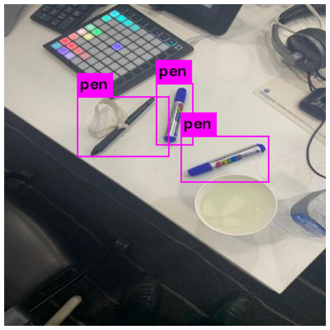

# penDetect
# 개요
팬을 찾아요.	

# 사용방법
* Colab에서 [PenDection_yolo4.ipynb](https://colab.research.google.com/github/nowage/penDetect/blob//main/PenDection_yolo4.ipynb) 파일 실행

# Data
## 원본 이미지
* 11개	
## Annotation box
28

# Train
* 3시간 소요

# 결과

<!--stackedit_data:
eyJoaXN0b3J5IjpbLTE1MTg5ODYyNzEsLTE1MDEwMTQ2OThdfQ
==
-->